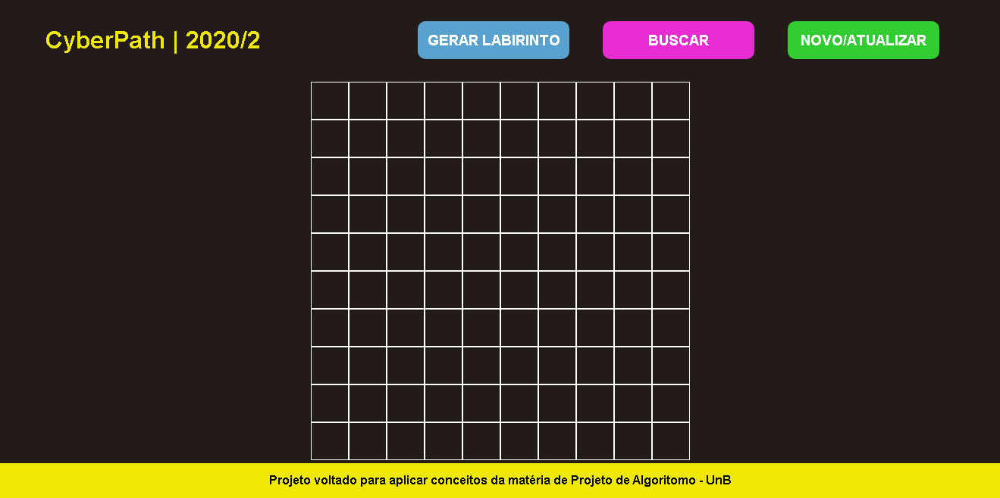
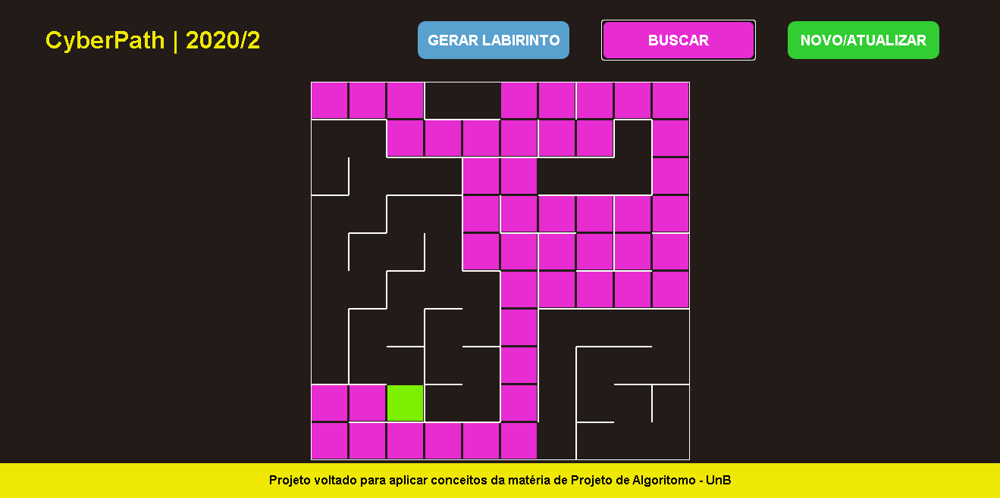
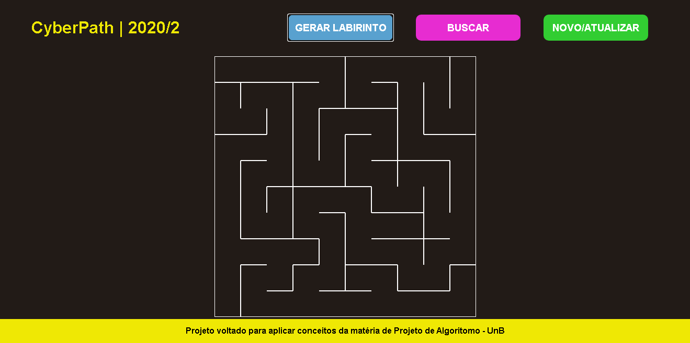

# CyberPath

**Conteúdo da Disciplina**: Grafos1 

## Alunos
|Matrícula | Aluno |
| -- | -- |
| 18/0118005  |  Carlos Rafael Vasconcelos de Matos |
| 17/0020525  |  Pedro Henrique de Lima Malaquias |

## Sobre 
 Gerar um labirinto a partir do uso do algoritomo DFS. Ao aplicar a buscar é gerado um destino aleatorio no labirinto. A busca utiliza o algoritimo BSF para encontrar o menor caminho até esse destino. O projeto se encontra hopesdado neste <a href="https://cyberpath.netlify.app" target="_top">link</a>.
 

## Screenshots

## Instalação 
**Linguagem**:JavaScript 
* Internet
* Navegador
* VScode com o plugin Live Server
* Terminal
* Caso não use o VScode: Basta abrir o arquivo index.html pelo navegador.

## Uso 
Inicie o live server ou abra o arquivo index.html em algum navegador de preferência.

[Index](index.html)

## Vídeo
<a href="https://www.youtube.com/watch?v=qP46U96Y_Fw&feature=youtu.be" target="_top">Link</a> para o vídeo explicativo.

